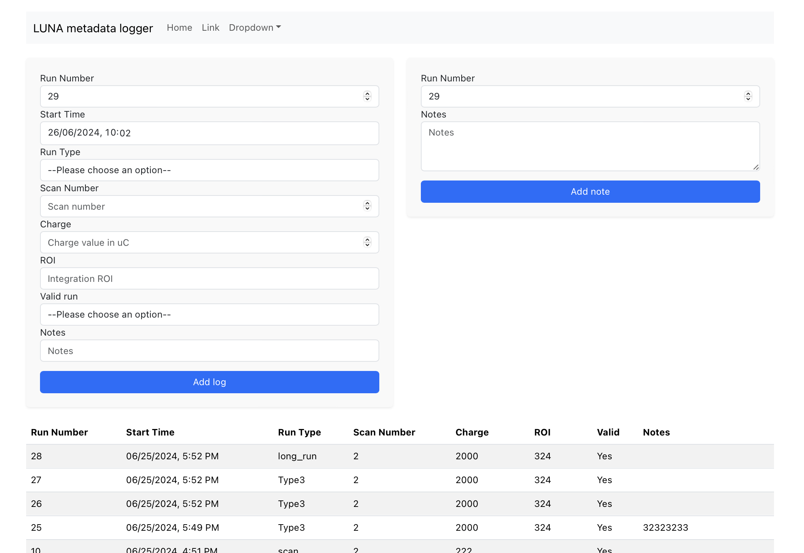

# LUNA-metadata-logger

## Description
A web application for logging and visualizing metadata.

## Features
- [x] User interface for logging metadata built with React.js
- [x] Metadata storage in SQLite database
- [x] User authentication and registration
- [x] Table to display the last logged entries 
- [ ] Support for visualization options

## Technologies Used

### Backend
- Express: Web framework for handling HTTP requests.
- Sequelize: ORM for database interactions.
- SQLite: Database for storing user and run data.
- bcryptjs: Library for hashing passwords.
- jsonwebtoken: Library for handling JSON Web Tokens for authentication.
- Cors: Middleware for enabling Cross-Origin Resource Sharing.
### Frontend
- React: Library for building user interfaces.
- Axios: Library for making HTTP requests.
- Bootstrap: Framework for responsive design and styling.
### Dev Tools
- Concurrently: Tool for running multiple commands concurrently.
- nodemon: Tool for automatically restarting the server on code changes.

## Setup

### Server
1. Navigate to the `/server` directory.
2. Run `npm install` to install dependencies.
3. Run `npm start` to start the server.

### Client
1. Navigate to the `/client` directory.
2. Run `npm install` to install dependencies.
3. Run `npm start` to start the client.

### Run both server and client
1. Run `npm install` to install dependencies.
2. Run `npm start` to start the server.

## Usage
Open `http://localhost:3001` in your browser to access the client application.